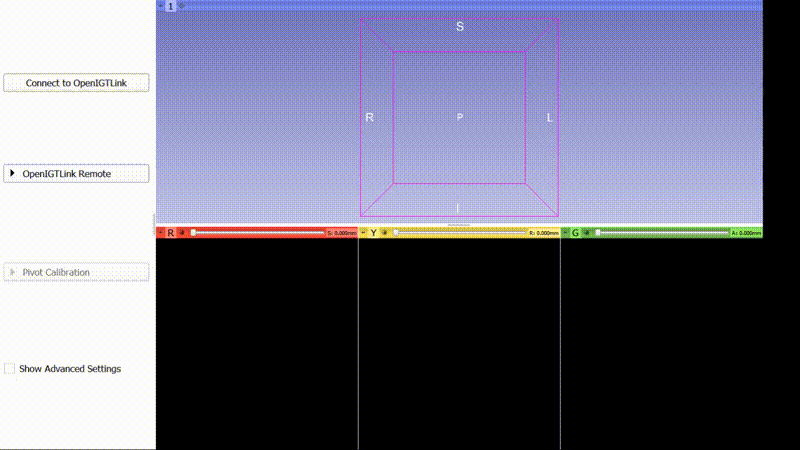

Skull Base Navigation
===============================

.. image:: https://weisslab.cs.ucl.ac.uk/WEISS/SoftwareRepositories/SkullBaseNavigation/raw/master/project-icon.png
   :height: 128px
   :width: 128px
   :target: https://weisslab.cs.ucl.ac.uk/WEISS/SoftwareRepositories/SkullBaseNavigation

.. image:: https://weisslab.cs.ucl.ac.uk/WEISS/SoftwareRepositories/SkullBaseNavigation/badges/master/build.svg
   :target: https://weisslab.cs.ucl.ac.uk/WEISS/SoftwareRepositories/SkullBaseNavigation/pipelines
   :alt: GitLab-CI test status

.. image:: https://weisslab.cs.ucl.ac.uk/WEISS/SoftwareRepositories/SkullBaseNavigation/badges/master/coverage.svg
    :target: https://weisslab.cs.ucl.ac.uk/WEISS/SoftwareRepositories/SkullBaseNavigation/commits/master
    :alt: Test coverage

.. image:: https://travis-ci.org/WEISS/SoftwareRepositories/SkullBaseNavigation.svg?branch=master
    :target: https://travis-ci.org/WEISS/SoftwareRepositories/SkullBaseNavigation
    :alt: Travis test status

.. image:: https://weisslab.cs.ucl.ac.uk/WEISS/SoftwareRepositories/SkullBaseNavigation/badges/master/coverage.svg
   :target: https://weisslab.cs.ucl.ac.uk/WEISS/SoftwareRepositories/SkullBaseNavigation/pipelines

.. image:: https://readthedocs.org/projects/SkullBaseNavigation/badge/?version=latest
    :target: http://SkullBaseNavigation.readthedocs.io/en/latest/?badge=latest
    :alt: Documentation Status
    

Author: Thomas Dowrick

Skull Base Navigation was developed at the `Wellcome EPSRC Centre for Interventional and Surgical Sciences`_ in `University College London (UCL)`_.

Requirements
^^^^^^^^^^

Slicer and SlicerIGT Extension

Running
^^^^^^^^^^

The below assumes that you are in the root directory of the **SkullBaseNavigation** repository.

Run the slicelet:
::
    /path/to/slicer/Slicer --no-main-window --python-script skullbasenavigation/sbn_slicelet.py
    
*no_main_window* runs the slicelet standalone, running without this also launches the standard Slicer GUI.

There are some basic unit tests implemented, these can be ran using:

::

    /path/to/slicer/Slicer --python-script skullbasenavigation/test/test_slicer_functions.py

    

Developing
^^^^^^^^^^

You can clone the repository using the following command:

::

    git clone https://weisslab.cs.ucl.ac.uk/WEISS/SoftwareRepositories/SkullBaseNavigation

Contributing
^^^^^^^^^^^^

Please see the `contributing guidelines`_.

Useful links
^^^^^^^^^^^^

`Source code repository`_
`Documentation`_

Licensing and copyright
-----------------------

Copyright 2018 University College London.
Skull Base Navigation is released under the BSD-3 license. Please see the `license file`_ for details.

Acknowledgements
----------------

Supported by `Wellcome`_ and `EPSRC`_.

.. _`Wellcome EPSRC Centre for Interventional and Surgical Sciences`: http://www.ucl.ac.uk/weiss
.. _`source code repository`: https://weisslab.cs.ucl.ac.uk/WEISS/SoftwareRepositories/SkullBaseNavigation
.. _`Documentation`: https://SkullBaseNavigation.readthedocs.io
.. _`University College London (UCL)`: http://www.ucl.ac.uk/
.. _`Wellcome`: https://wellcome.ac.uk/
.. _`EPSRC`: https://www.epsrc.ac.uk/
.. _`contributing guidelines`: https://weisslab.cs.ucl.ac.uk/WEISS/SoftwareRepositories/SkullBaseNavigation/blob/master/CONTRIBUTING.rst
.. _`license file`: https://weisslab.cs.ucl.ac.uk/WEISS/SoftwareRepositories/SkullBaseNavigation/blob/master/LICENSE

.. toctree::
   :maxdepth: 4
   :caption: Contents:
